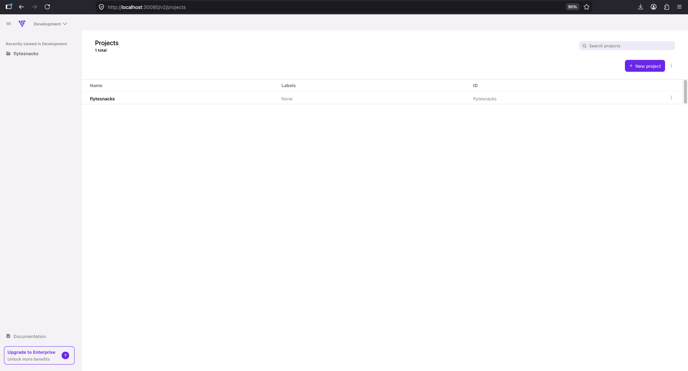
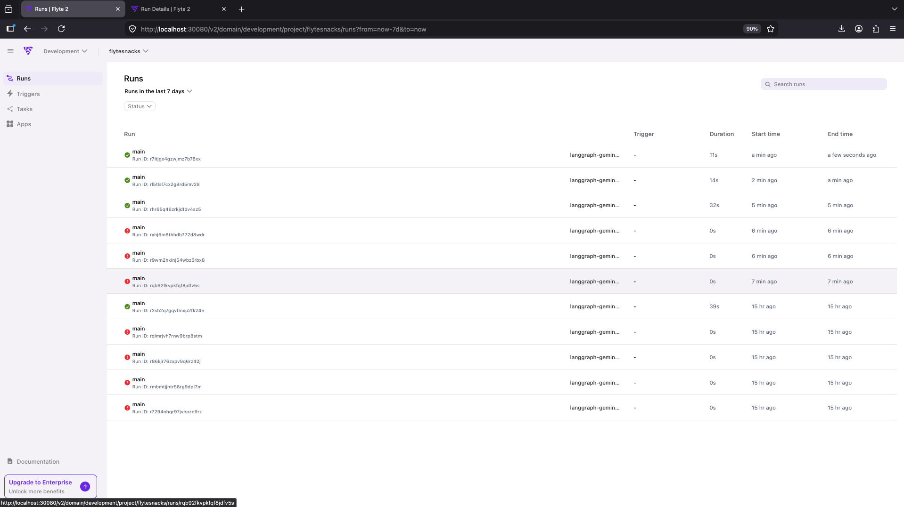
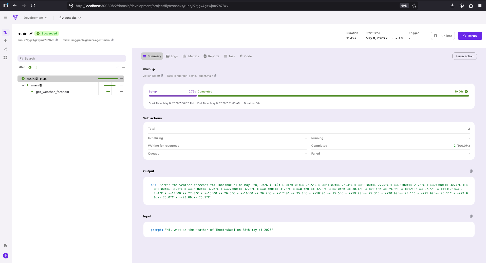
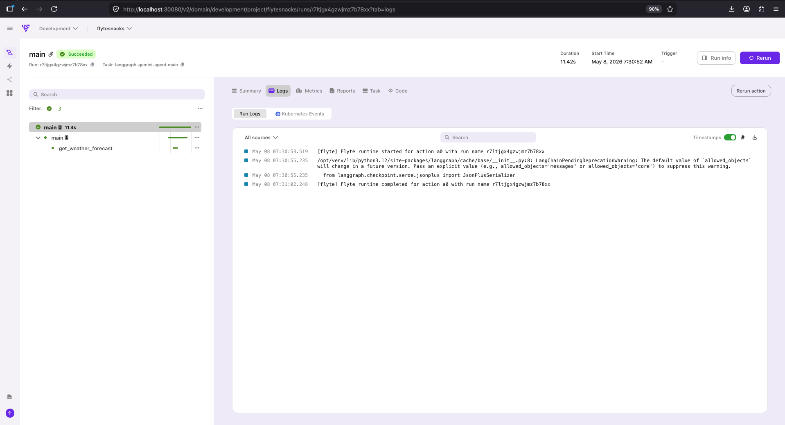
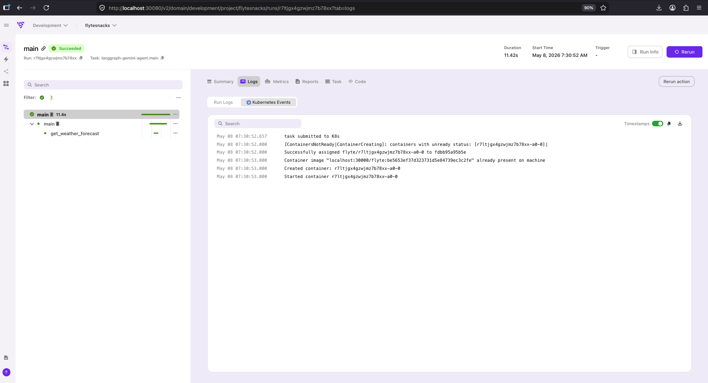

# 🚀 AgentOps with Flyte

Production-style AgentOps orchestration platform using Flyte, Gemini AI, Kubernetes, and distributed workflow execution with real-time observability.

---

## 🔥 Features

* AI Agent Workflow Orchestration
* Flyte-based Task Scheduling
* Gemini AI Integration
* Distributed Task Execution
* Workflow Monitoring & Observability
* Kubernetes Runtime Events
* Runtime Logging
* Secret Management
* Containerized Execution
* Real-Time Workflow Tracking

---

## 🛠️ Tech Stack

* Flyte
* Python
* LangGraph
* LangChain
* Gemini AI
* Docker
* Kubernetes

---

## 📂 Project Structure

```bash
agentops-with-flyte/
├── screenshots/
├── weather_agent.py
├── weather_agent_with_flyte.py
├── requirements.txt
└── README.md
```

---

## ⚙️ Environment Setup

### Create Virtual Environment

```bash
python3 -m venv .flyte
```

### Activate Environment

#### macOS/Linux

```bash
source .flyte/bin/activate
```

#### Windows

```bash
.flyte\Scripts\activate
```

---

## 📦 Install Dependencies

### Install Flyte

```bash
pip install "flyte[tui]"
```

### Install Project Requirements

```bash
pip install -r requirements.txt
```

---

## 🚀 Running the Project

### Start Flyte Devbox

```bash
flyte start devbox
```

Expected Output:

```text
🚀 UI:             http://localhost:30080/v2
🐳 Image Registry: localhost:30000
```

---

### Create Flyte Config

```bash
flyte create config \
  --endpoint localhost:30080 \
  --project flytesnacks \
  --domain development \
  --builder local \
  --insecure
```

---

### Create Gemini Secret

```bash
flyte create secret GOOGLE_GEMINI_API_KEY \
  --project flytesnacks \
  --domain development
```

Verify Secret:

```bash
flyte get secret
```

---

### Run Workflow

```bash
flyte run weather_agent_with_flyte.py main \
  --prompt "Hi. what is the weather of Thoothukudi on 08th may of 2026"
```

---

## 📸 Screenshots

### Flyte Project Overview



### Real-Time Run Monitoring



### Workflow Execution Dashboard



### Runtime Logs



### Kubernetes Runtime Events



---

## 📊 Workflow Architecture

```text
User Prompt
     ↓
Flyte Workflow
     ↓
LangGraph Agent
     ↓
Gemini AI
     ↓
Weather Forecast Response
```

---

## 📈 Project Highlights

* Built AI workflow orchestration using Flyte
* Implemented Gemini-powered AI agents
* Added containerized remote execution
* Enabled workflow observability and monitoring
* Integrated Kubernetes runtime tracking
* Managed secrets securely using Flyte secrets
* Implemented distributed workflow execution
* Built production-style AgentOps pipeline

---

## 🧠 Example Prompt

```bash
flyte run weather_agent_with_flyte.py main \
  --prompt "Hi. what is the weather of Thoothukudi on 08th may of 2026"
```

---

## 🛠️ Common Issues

### Docker Registry Timeout

Error:

```text
dial tcp [::1]:30000: i/o timeout
```

Fix:

```bash
flyte start devbox
```

---

### Secret Not Found

Verify secret exists:

```bash
flyte get secret
```

---

## 🎯 Future Improvements

* Multi-agent orchestration
* Prometheus + Grafana monitoring
* Real-time metrics dashboard
* AWS EKS deployment
* Advanced AgentOps observability
* OpenTelemetry tracing
* Agent memory persistence

---

## 📜 License

MIT License

---

## 👨‍💻 Author

Sudalaimani S

---

## ⭐ GitHub

If you found this project useful, give it a star ⭐
